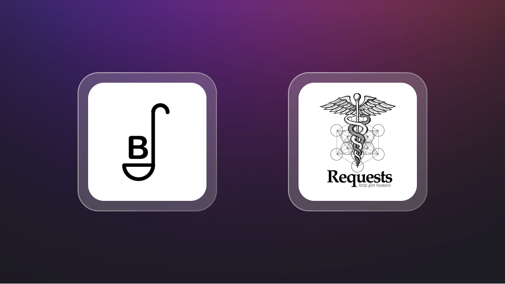
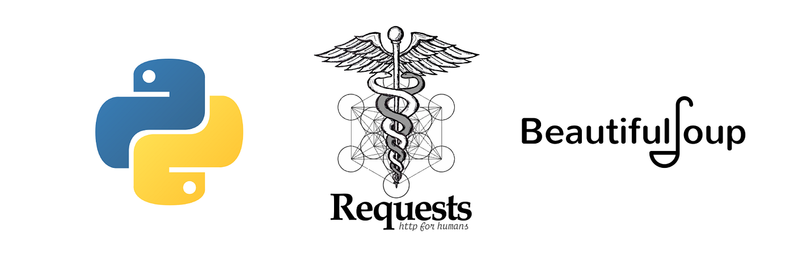

# CanvaScraping

What are you trying to do? 
- 
- Creating a python program to faciliate group bible study. The application will scrape from the bible hub website (biblehub.com). This will be done by me creating an API. 

How is it done today, and what are the limits of current practice?
- 
- Today, when reading the bible individuals may struggle to find an easily accessible resource, presented in a fun, intuative way to faciliate study. The limits of the current practice is that it will reduce their ability to fully apply what they have learnt. 

What is new in your approach and why do you think it will be successful?
- 
- The new approach will be an novel, engaging way to engage with study questions. It will support _user input_. The user will be able to select the specific book and chapter that they would like to focus on through the application. I will present this information through a user-interface (designing a front-end website).

Who cares? If you are successful, what difference will it make?
-  
- Everyone who is keen to become more effective in their study of the word, will care about this project. The difference it will make is that it will support more effective study for those keen to develop their knowledge of the word.  

What are the risks?
- 

How much will it cost?
- 

How long will it take?
- 

What are the mid-term and final “exams” to check for success? 
- 
- I will first build the back-end API web scraper and test the functionality getting feedback. Once I recieve feedback, I will then design prototypes for the front end website, again getting feedback on the user experience and user interface. If users respond postively to this, for instance stating that the website makes it much easier for them to study the word, then I will classify this project as a success. 